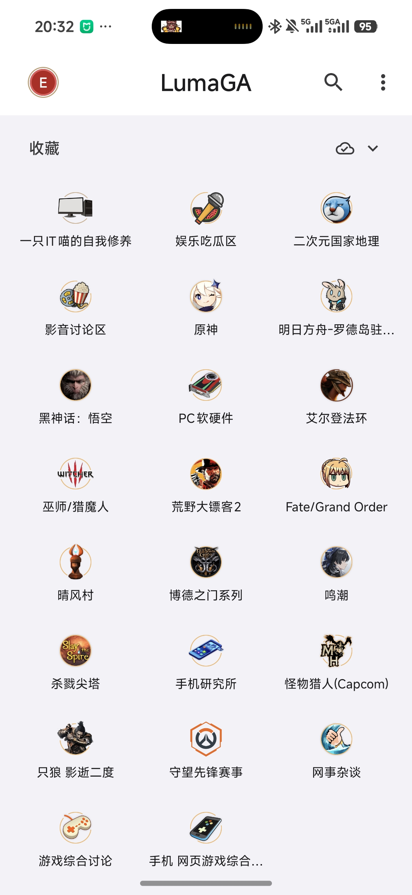
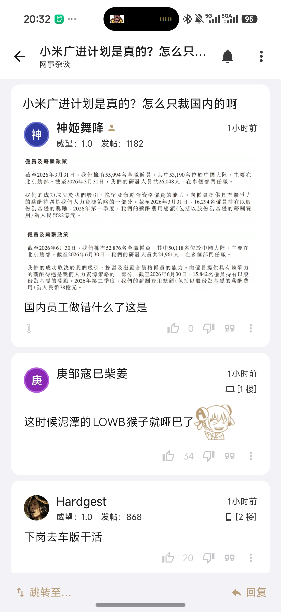

# LumaGA

**English** | [简体中文](README.zh-CN.md)

Android port of [MNGA](https://github.com/BugenZhao/MNGA), an NGA (bbs.nga.cn)
client. Built with Jetpack Compose, on top of the same Rust `logic` backend
MNGA uses, linked in as `liblogic.so` over JNI.

## Screenshots

Home | Topic list | Topic detail
--- | --- | ---
 |  | 

## Usage

- Download the latest APK from the [Releases](https://github.com/Duzc01/LumaGA/releases) page:
  - `app-release.apk` — signed release build (recommended)
  - `app-debug.apk` — debug build (built by CI on every push)
- Install and sign in with your NGA account on first launch.
- `mnga://` deep links are supported, e.g. `mnga://forum/f/722` opens a forum
  directly; links copied to the clipboard are also detected and opened
  automatically when the app comes to the foreground.

## Layout

- `app/` — Compose UI, ported from the MNGA SwiftUI app.
- `logic/` — Android library module wrapping `liblogic.so` plus the generated
  protobuf Java/Kotlin sources.
- `rust/` — the Rust workspace `liblogic.so` is built from, vendored from MNGA.
  See [rust/README.md](rust/README.md).

## Build

```bash
./gradlew assembleDebug
```

Output: `app/build/outputs/apk/debug/app-debug.apk`. JDK 17 required.

Gradle does not build the Rust side. `liblogic.so` is committed under
`logic/src/main/jniLibs/`, so a plain Gradle build needs no NDK or Rust
toolchain. After changing anything under `rust/`, rebuild and commit the
libraries:

```bash
rust/build-jni-libs.sh      # liblogic.so for arm64-v8a, x86_64, x86
rust/gen-kotlin-protos.sh   # only when rust/protos/ changed
```

Both need `protoc`; the first also needs `cargo-ndk` and an Android NDK.

## CI

- [ci.yml](.github/workflows/ci.yml) builds the debug APK on every push/PR to
  `main` and uploads it as an artifact.
- [rust.yml](.github/workflows/rust.yml) rebuilds `liblogic.so` for all three
  ABIs and runs the Rust unit tests, on changes under `rust/` or on demand.

## Attribution

MNGA ships without a LICENSE file and its README reserves all rights, so this
port — including the Rust sources vendored under `rust/` — is not
redistributable without permission from its author. Vendored sled keeps its own
MIT/Apache-2.0 license files in `rust/logic/sled/`.
